**The setup instructions in this document have been deprecated. Please follow the steps outlined [here](https://www.elastic.co/guide/en/security/current/host-risk-score.html), to enable Host Risk Score in your environment.** 
# Host Risk Score

Host Risk Score is an experimental feature that assigns risk scores to hosts in a given Kibana space. Risk scores are calculated for each host by utilizing transforms on the alerting indices. The transform runs hourly to update the score as new alerts are generated. The Host Risk Score [package](https://github.com/elastic/detection-rules/releases) contains all of the required artifacts for setup. The Host Risk Score feature provides drilldown Lens dashboards and additional Kibana features such as the **Host Risk Score Card** on the Overview page of the Elastic Security app, and the **Host Risk Keyword** on the Alert details flyout for an enhanced experience.

### Notes
 - **Host name collision**: Hosts are identified by the `host.name` field in alerts. There may be some edge cases where different hosts use the same name. [details](#host-name-collision-details)


## Setup Instructions

 1. [Obtain artifacts](#obtain-artifacts) 
 2. [Upload scripts](#upload-scripts)
 3. [Upload ingest pipeline](#upload-ingest-pipeline)
 4. [Upload and start the `pivot` transform](#upload-start-pivot)
 5. [Create the Host Risk Score index](#host-risk-index)
 6. [Upload and start the `latest` transform](#upload-start-latest)
 7. [Import dashboards](#import-dashboards)
 8. [Enable Kibana features](#enable-kibana)

<h3 id="modify-artifacts">1. Obtain artifacts</h3>

The Host Risk Score functionality is space aware for privacy. Downloaded artifacts must be modified with the desired space before they can be used.

 - Download the release bundle from [here](https://github.com/elastic/detection-rules/releases). The Host Risk Score releases can be identified by the tag `ML-HostRiskScore-YYYYMMDD-N`. Check the release description to make sure it is compatible with the Elastic Stack version you are running.
 - Unzip the contents of `ML-HostRiskScore-YYYYMMDD-N.zip`.
 - Run `ml_hostriskscore_generate_scripts.py` script in the unzipped directory with your Kibana space as the argument.
<div style="margin-left: 40px">   
<i>Example of modifying artifacts for the default space</i>
   <pre style="margin-top:-2px"><code>python ml_hostriskscore_generate_scripts.py --space default
</code></pre></div>

 - Find a new folder named after your space in the unzipped directory. **You will be using the scripts within this directory for the next steps.**

 **Note:** Host Risk Score artifacts should be updated if/when you update to a newer Elastic Stack version. To do this, simply download a release bundle that is compatible with your new Stack version and repeat all the steps. Backwards compatibility of release bundles is not guaranteed.


<h3 id="upload-scripts">2. Upload scripts</h3>

- Navigate to `Management / Dev Tools` in Kibana.
- Upload the contents of `ml_hostriskscore_levels_script.json`, `ml_hostriskscore_map_script.json`, `ml_hostriskscore_reduce_script.json` and `ml_hostriskscore_init_script.json` (for Elastic Stack version 8.1+ only) using the Script API with the following syntax.
- Ensure that your space name (such as `default`) replaces `<your-space-name>` in the script names below.

<div style="margin-left: 40px">   
<i>uploading scripts</i>
   <pre style="margin-top:-2px"><code>
PUT _scripts/ml_hostriskscore_levels_script_&lt;your-space-name&gt;
{contents of ml_hostriskscore_levels_script.json file}
</code></pre></div>

<div style="margin-left: 40px">
   <pre><code>
PUT _scripts/ml_hostriskscore_map_script_&lt;your-space-name&gt;
{contents of ml_hostriskscore_map_script.json file}
</code></pre></div>

<div style="margin-left: 40px">
   <pre><code>
PUT _scripts/ml_hostriskscore_reduce_script_&lt;your-space-name&gt;
{contents of ml_hostriskscore_reduce_script.json file}
</code></pre></div>

<i>For Elastic Stack version 8.1+ only</i>
<div style="margin-left: 40px">
   <pre><code>
PUT _scripts/ml_hostriskscore_init_script_&lt;your-space-name&gt;
{contents of ml_hostriskscore_init_script.json file}
</code></pre></div>


<h3 id="upload-ingest-pipeline">3. Upload ingest pipeline</h3>

- Upload the contents of `ml_hostriskscore_ingest_pipeline.json` using the Ingest API with the following syntax.
- Ensure that your space name (such as `default`) replaces `<your-space-name>` below.

<div style="margin-left: 40px">   
<i>uploading ingest pipeline</i>
   <pre style="margin-top:-2px"><code>PUT _ingest/pipeline/ml_hostriskscore_ingest_pipeline_&lt;your-space-name&gt;
{contents of ml_hostriskscore_ingest_pipeline.json file}
</code></pre></div>


<h3 id="upload-start-pivot">4. Upload and start the <code>pivot</code> transform</h3>

This transform calculates the risk level every hour for each host in the Kibana space specified.

- Upload the contents of `ml_hostriskscore_pivot_transform.json` using the Transform API with the following syntax.
- Ensure that your space name (such as `default`) replaces `<your-space-name>` below.

<div style="margin-left: 40px">   
<i>uploading pivot transform</i>
   <pre style="margin-top:-2px"><code>PUT _transform/ml_hostriskscore_pivot_transform_&lt;your-space-name&gt;
{contents of ml_hostriskscore_pivot_transform.json file}
</code></pre></div>

- Navigate to `Transforms` under `Management / Stack Management` in Kibana. Find the transform with the ID `ml_hostriskscore_pivot_transform_<your-space-name>`. Open the `Actions` menu on the right side of the row, then click `Start`.
- Confirm the transform is working as expected by navigating to `Management / Dev Tools` and ensuring the target index exists.

<div style="margin-left: 40px">   
<i>sample test query</i>
   <pre style="margin-top:-2px"><code>GET ml_host_risk_score_&lt;your-space-name&gt;/_search
</code></pre></div>

<h3 id="host-risk-index">5. Create the Host Risk Score index</h3>

- Navigate to `Management / Dev Tools` in Kibana.
- Create the Host Risk Score index (`ml_host_risk_score_latest_<your-space-name>`) with the following mappings.
- Ensure that your space name (such as `default`) replaces `<your-space-name>` below.

<div style="margin-left: 40px">   
<i>creating the Host Risk Score index</i>
   <pre style="margin-top:-2px"><code>PUT ml_host_risk_score_latest_&lt;your-space-name&gt;
{
  "mappings":{
    "properties":{
      "host.name":{
        "type":"keyword"
      }
    }
  }
}
</code></pre></div>

<h3 id="upload-start-latest">6. Upload and start the <code>latest</code> transform</h3>

This transform recurringly calculates risk levels for all hosts in the Kibana space specified.

- Upload the contents of `ml_hostriskscore_latest_transform.json` using the Transform API with the following syntax.
- Ensure that your space name (such as `default`) replaces `<your-space-name>` below.

<div style="margin-left: 40px">   
<i>uploading latest transform</i>
   <pre style="margin-top:-2px"><code>PUT _transform/ml_hostriskscore_latest_transform_&lt;your-space-name&gt;
{contents of ml_hostriskscore_latest_transform.json file}
</code></pre></div>

- Navigate to `Transforms` under `Management / Stack Management` in Kibana. Find the transform with the ID `ml_hostriskscore_latest_transform_<your-space-name>`. Open the `Actions` menu on the right side of the row, and click `Start`.
- Confirm the transform is working as expected by navigating to `Management / Dev Tools` and ensuring the target index exists. You should see documents starting to appear in the index if there is ongoing alerting activity associated with hosts.

<div style="margin-left: 40px">   
<i>sample test query</i>
   <pre style="margin-top:-2px"><code>GET ml_host_risk_score_latest_&lt;your-space-name&gt;/_search
</code></pre></div>

<h3 id="import-dashboards">7. Import dashboards</h3>

- Navigate to `Management / Stack Management / Kibana / Saved Objects` in Kibana.
- Click on `Import` and import the `ml_hostriskscore_dashboards.ndjson` file.
- Navigate to `Analytics / Dashboard`.
- Confirm you can see a dashboard named `Current Risk Scores for Hosts`, which displays the current list (Top 20) of suspicious hosts in your environment.
- Confirm you can see a dashboard named `Drilldown of Host Risk Score`, which allows you to further drill down into details of the risk associated with a particular host of interest.

<h3 id="enable-kibana">8. Enable Kibana features</h3>

To enable the Kibana features for Host Risk Score, you will first need to add the following configuration to `kibana.yml`.

```
xpack.securitySolution.enableExperimental: ['riskyHostsEnabled']
```

#### Instructions to modify `kibana.yml` on Elastic Cloud

1. Navigate to your deployment on the cloud
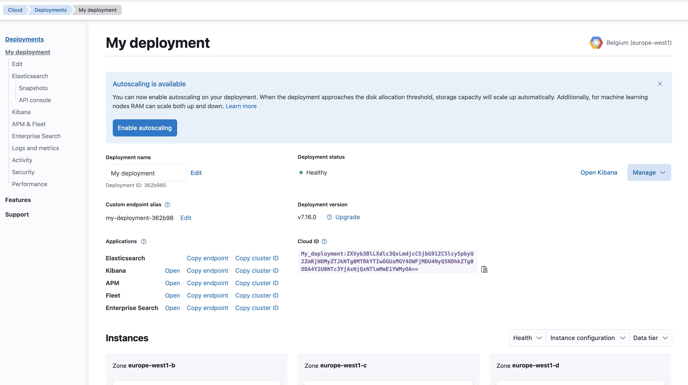


2. Click on Kibana on the sidebar and click on Edit configuration on your Kibana instance
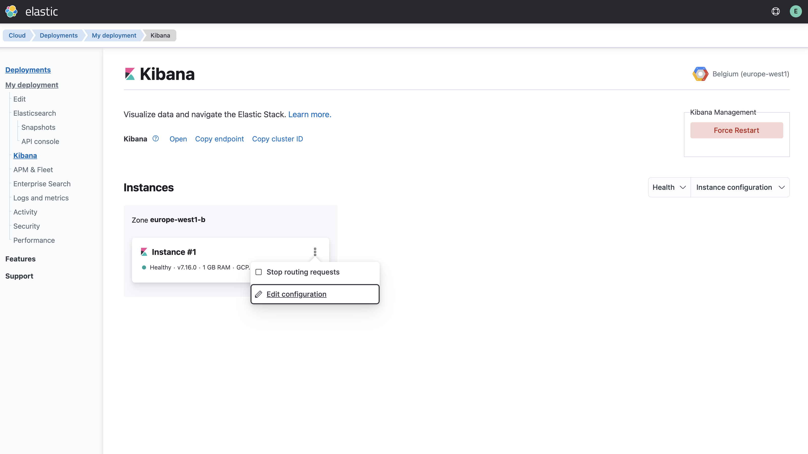


3. Click on Edit user settings
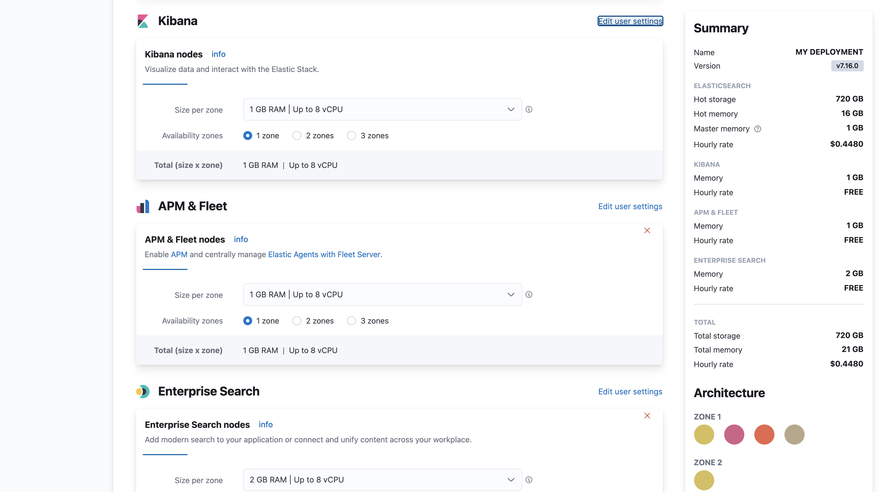


4. Modify Kibana configuration by adding `xpack.securitySolution.enableExperimental: ['riskyHostsEnabled']`
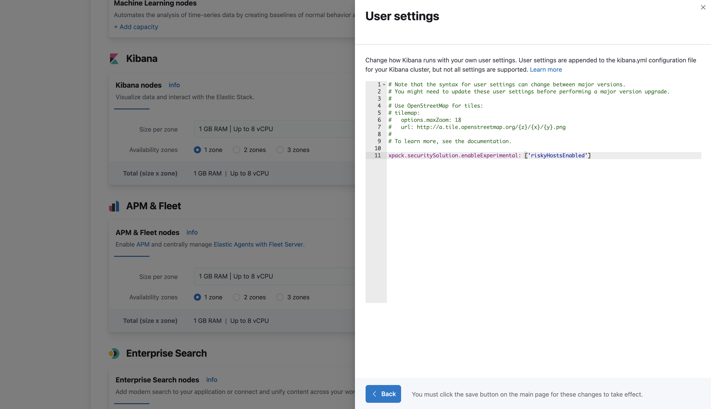


5. Save updated Kibana settings
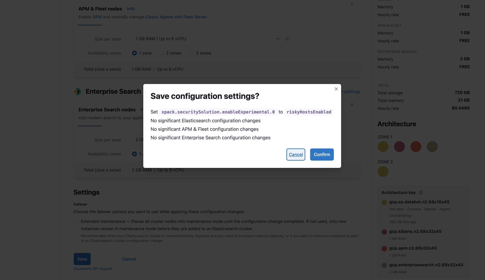
   

6. Confirm activity finished
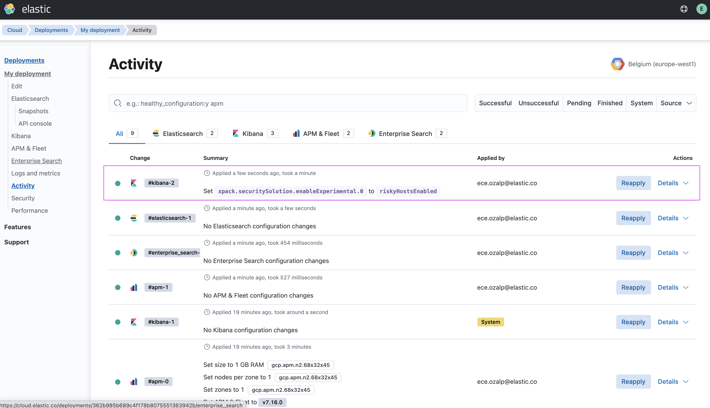


7. View Host Risk Score Card on the Overview page
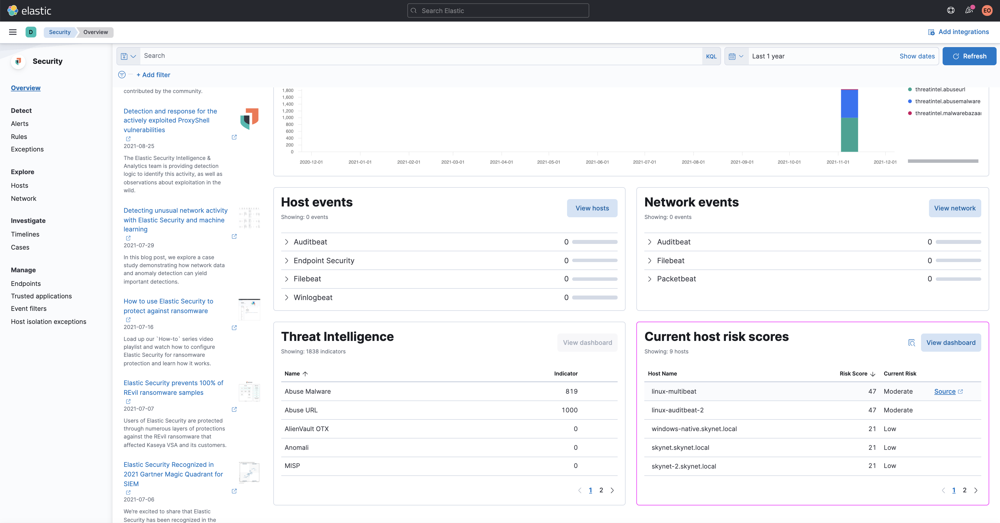


Once you have modified the `kibana.yml` file, you will find Host Risk Scoring features in the following Kibana locations:

_Host Risk Score card on the Overview page_


_Host Risk Keyword on Alert Details Flyout_
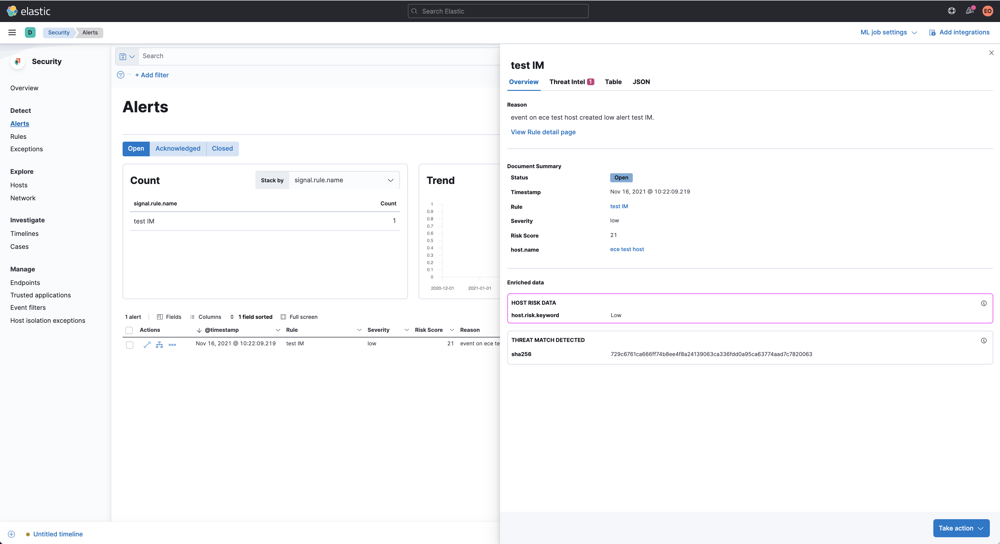

For Elastic Stack version 8.1+ only:

_Host risk classification column in the All hosts table on the Hosts page_
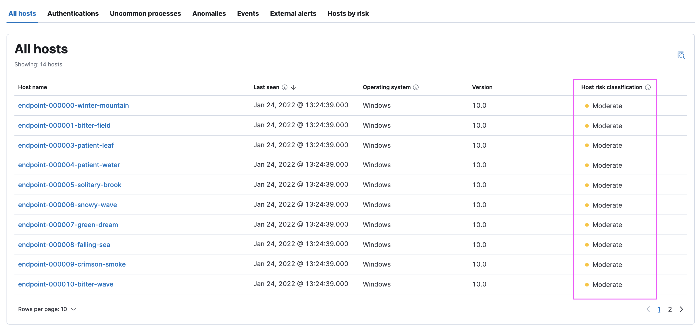

_Hosts by risk tab on the Hosts page_
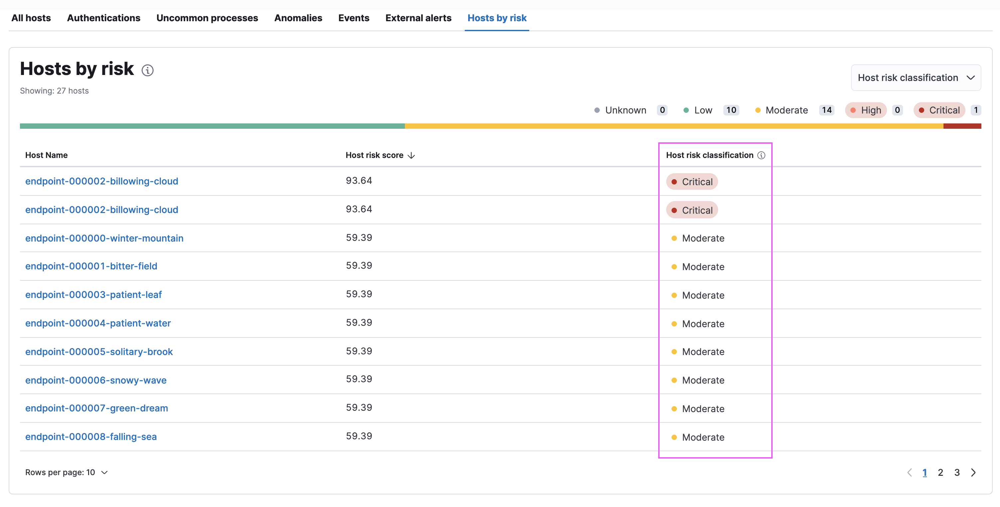

The host risk table in the above tab is not affected by the KQL time range. The table shows the latest recorded risk score for each host.

_Host risk overview on the Host details page_
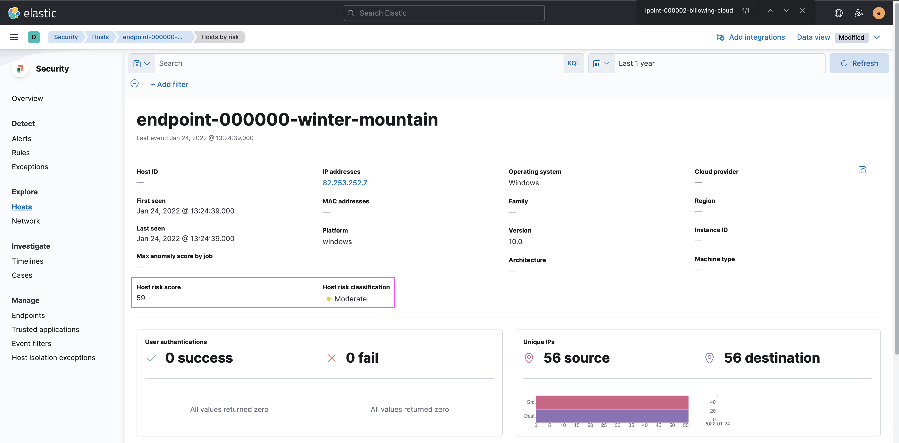

_Hosts by risk tab on the Host details page_
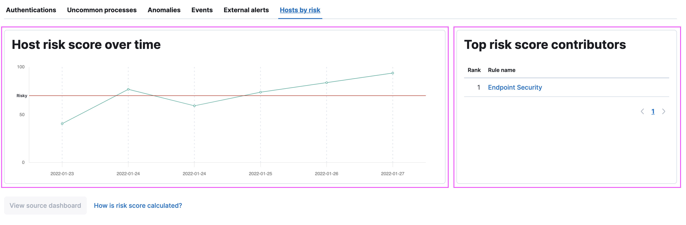

<hr/>

##### Host name collision details

Physical Windows clients - desktops and laptops - in an Active Directory forest are unlikely to have name collisions, as their computer accounts and distinguished names should be unique. Non-domain member servers, desktops and laptops, in a Windows workgroup, may occasionally have name collisions. Macs are often not managed by a directory service and may have name collisions. Virtual servers, that are created from templates or cloning processes may have hostname collisions.
